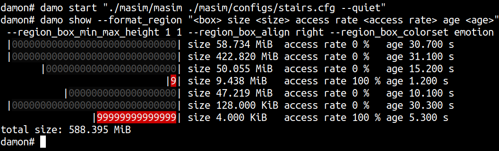

THIS REPO IS DEPRECATED
=======================

This repo (https://github.com/awslabs/damo) was one of the official GitHub
repos for damo.  However, after 2024-09-05, this has been[1] no longer the
official GitHub repo.  Please use the new official GitHub repo
(https://github.com/damonitor/damo) or the kernel.org repo
(https://git.kernel.org/pub/scm/linux/kernel/git/sj/damo.git/) instead.

[1] https://lore.kernel.org/20240813232158.83903-1-sj@kernel.org

---

DAMO: Data Access Monitoring Operator
=====================================

`damo` is a user space tool for [DAMON](https://damonitor.github.io).  Using
this, you can monitor the data access patterns of your system or workloads and
make data access-aware memory management optimizations.

Official Repositories
---------------------

Official git repos for `damo` are hosted on kernel.org and GitHub:

- kernel.org: https://git.kernel.org/pub/scm/linux/kernel/git/sj/damo.git
- GitHub: https://github.com/damonitor/damo

Note that the repo under awslabs GitHub organization
(https://github.com/awslabs/damo) was used as the official repo
before.  It
[will](https://lore.kernel.org/20240813232158.83903-1-sj@kernel.org) be no more
official repo that maintained by DAMON maintainer after 2024-09-05.

Demo Video
==========

Please click the below thumbnail to show the short demo video.

Getting Started
===============

Follow below instructions and commands to monitor and visualize the access
pattern of your workload.

    $ # ensure DAMON is enabled on your kernel
    $ # install damo using packaging systems listed above,
    $ # or cloning the source repo and updating $PATH.
    $ sudo damo start $(pidof <your workload>)
    $ sudo damo show
    $ sudo damo record ongoing
    $ sudo damo report heats --heatmap stdout --stdout_heatmap_color emotion

The second and last commands will show the access pattern of your workload,
like below:

FAQs
====

How can I ensure DAMON is enabled on my kernel?
-----------------------------------------------

Please refer to 'Install'
[section](https://sjp38.github.io/post/damon/#install) of the project webpage.

Where can I get more detailed usage?
------------------------------------

The below sections provide quick introductions for `damo`'s major features.
For more detailed usage, please refer to [USAGE.md](USAGE.md) file.

What does the version numbers mean?
-----------------------------------

Nothing at all but indicate which version is more fresh.  A higher version
number means it is more recently released.

Will `pip3 install damo` install the latest version of `damo`?
--------------------------------------------------------------

It will install the latest _stable_ version of `damo`.  If you want, you can
also install less stable but more fresh `damo` from source code.  For that,
fetch the `next` branch of the source tree and use `damo` executable file in
the tree.

    $ git clone https://github.com/damonitor/damo -b next

How can I participate in the development of `damo`?
---------------------------------------------------

Please refer to
[CONTRIBUTING](https://github.com/damonitor/damo/blob/next/CONTRIBUTING) file.

Why some features are not documented on [USAGE.md](USAGE.md) file?
------------------------------------------------------------------

Because those are not yet stabilized.  In other words, such features are in
their experimental stages, and therefore could be deprecated and removed
without notice and grace periods.  The documented features could also be
deprecated, but those will provide some notifications and grace periods.  If
there are some features you're relying on but not documented, please
[report](REPORTING.md) your usecase to the community.

How can I know deprecation schedule and alternatives of specific features?
--------------------------------------------------------------------------

The list of features that will be, or already deprecated, the deprecation
schedule, and their alternatives are summarized in
[FEATURES_DEPRECATION_SCHEDULE.md](FEATURES_DEPRECATION_SCHEDULE.md) file.

Quick Intro for Major Features
==============================

Below are quick introductions for `damo`'s major features.
For more detailed usage, please refer to [USAGE.md](USAGE.md) file.

Snapshot Data Access Pattern
----------------------------

Below commands repeatedly get a snapshot of the access pattern of a program for
every second.

    $ git clone https://github.com/sjp38/masim
    $ cd masim; make; ./masim ./configs/zigzag.cfg --silent &
    $ sudo damo start --target_pid $(pidof masim)
    $ while :; do sudo damo show; sleep 1; done

The first two lines of the commands get an artificial memory access generator
program and run it in the background.  It will repeatedly access two 100
MiB-sized memory regions one by one.  You can substitute this with your real
workload.

The third line asks ``damo`` to start monitoring the access pattern of the
process.  Finally, the last line retries a snapshot of the monitoring results
every second and show on terminal.

Recording Data Access Patterns
------------------------------

Below commands record memory access patterns of a program and save the
monitoring results in `damon.data` file.

    $ git clone https://github.com/sjp38/masim
    $ cd masim; make; ./masim ./configs/zigzag.cfg --silent &
    $ sudo damo record -o damon.data $(pidof masim)

The first two lines of the commands get an artificial memory access generator
program and run it in the background.  It will repeatedly access two 100
MiB-sized memory regions one by one.  You can substitute this with your real
workload.  The last line asks ``damo`` to record the access pattern in
``damon.data`` file.

Visualizing Recorded Patterns
-----------------------------

Below three commands visualize the recorded access patterns into three
image files.

    $ damo report heats --heatmap stdout
    $ damo report wss --range 0 101 1
    $ damo report wss --range 0 101 1 --sortby time --plot

- ``access_pattern_heatmap.png`` will show the data access pattern in a
  heatmap, which shows when (x-axis) what memory region (y-axis) is how
  frequently accessed (color).
- ``wss_dist.png`` will show the distribution of the working set size.
- ``wss_chron_change.png`` will show how the working set size has
  chronologically changed.

You can show the images on a web page [1].  Those made with other realistic
workloads are also available [2,3,4].

[1] https://damonitor.github.io/doc/html/latest/admin-guide/mm/damon/start.html#visualizing-recorded-patterns 
[2] https://damonitor.github.io/test/result/visual/latest/rec.heatmap.1.png.html 
[3] https://damonitor.github.io/test/result/visual/latest/rec.wss_sz.png.html 
[4] https://damonitor.github.io/test/result/visual/latest/rec.wss_time.png.html

Data Access Pattern Aware Memory Management
-------------------------------------------

Below command makes every memory region of size >=4K that hasn't accessed for
>=60 seconds in your workload to be swapped out.  By doing this, you can make
your workload more memory efficient with only modest performance overhead.

    $ sudo damo start --damos_access_rate 0 0 --damos_sz_region 4K max \
                        --damos_age 60s max --damos_action pageout \
                        <pid of your workload>

Holistic Memory Usage Monitoring
--------------------------------

You can also show access pattern heatmap, memory footprints, and hotspot
functions of the system and/or workloads all at once in live, like below.

