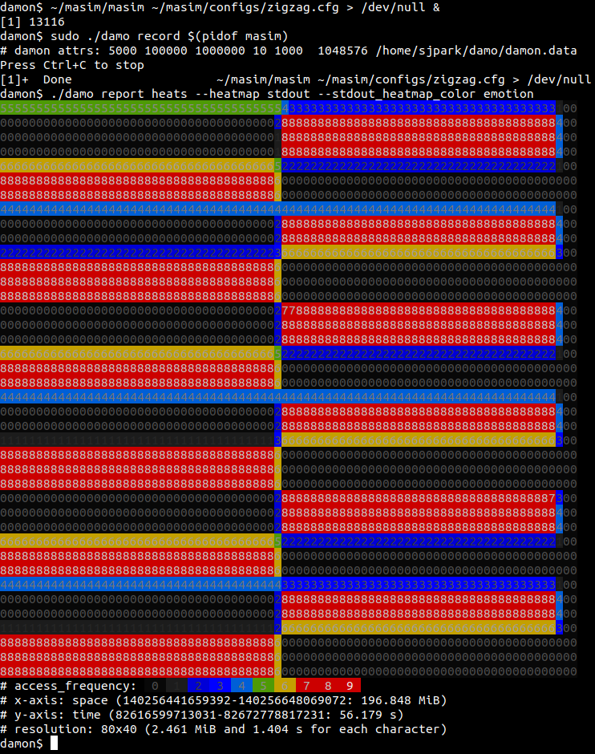

DAMO: Data Access Monitoring Operator
=====================================

`damo` is a user space tool for [DAMON](https://damonitor.github.io).  Using
this, you can monitor the data access patterns of your system or workloads and
make data access-aware memory management optimizations.

Demo Video
==========

Please click the below thumbnail to show the short demo video.

Getting Started
===============

Follow below instructions and commands to monitor and visualize the access
pattern of your workload.

    $ # ensure your kernel is built with CONFIG_DAMON_*=y
    $ sudo pip3 install damo
    $ sudo damo record $(pidof <your workload>)
    $ damo report heats --heatmap stdout --stdout_heatmap_color emotion

The last command will show the access pattern of your workload, like below:

FAQs
====

How can I install a kernel that is built with `CONFIG_DAMON_*=y`?
-----------------------------------------------------------------

Please refer to 'Install'
[section](https://sjp38.github.io/post/damon/#install) of the project webpage.

Where can I get more detailed usage?
------------------------------------

The below sections provide quick introductions for `damo`'s major features.
For more detailed usage, please refer to [USAGE.md](USAGE.md) file.

What does the version number mean?
----------------------------------

Nothing at all but indicate which version is more fresh.  A higher version
number means it is more recently released.

Will `pip3 install damo` install the latest version of `damo`?
--------------------------------------------------------------

It will install the latest _stable_ version of `damo`.  If you want, you can
also install less stable but more fresh `damo` from source code.  For that,
fetch the `next` branch of the source tree and use `damo` executable file in
the tree.

    $ git clone https://github.com/awslabs/damo -b next

How can I participate in the development of `damo`?
---------------------------------------------------

Please refer to
[CONTRIBUTING](https://github.com/awslabs/damo/blob/next/CONTRIBUTING) file.

Recording Data Access Patterns
==============================

Below commands record memory access patterns of a program and save the
monitoring results in `damon.data` file.

    $ git clone https://github.com/sjp38/masim
    $ cd masim; make; ./masim ./configs/zigzag.cfg &
    $ sudo damo record -o damon.data $(pidof masim)

The first two lines of the commands get an artificial memory access generator
program and run it in the background.  It will repeatedly access two 100
MiB-sized memory regions one by one.  You can substitute this with your real
workload.  The last line asks ``damo`` to record the access pattern in
``damon.data`` file.

Visualizing Recorded Patterns
=============================

Below three commands visualize the recorded access patterns into three
image files.

    $ damo report heats --heatmap access_pattern_heatmap.png
    $ damo report wss --range 0 101 1 --plot wss_dist.png
    $ damo report wss --range 0 101 1 --sortby time --plot wss_chron_change.png

- ``access_pattern_heatmap.png`` will show the data access pattern in a
  heatmap, which shows when (x-axis) what memory region (y-axis) is how
  frequently accessed (color).
- ``wss_dist.png`` will show the distribution of the working set size.
- ``wss_chron_change.png`` will show how the working set size has
  chronologically changed.

You can show the images on a web page [1].  Those made with other realistic
workloads are also available [2,3,4].

[1] https://damonitor.github.io/doc/html/latest/admin-guide/mm/damon/start.html#visualizing-recorded-patterns  
[2] https://damonitor.github.io/test/result/visual/latest/rec.heatmap.1.png.html  
[3] https://damonitor.github.io/test/result/visual/latest/rec.wss_sz.png.html  
[4] https://damonitor.github.io/test/result/visual/latest/rec.wss_time.png.html

Data Access Pattern Aware Memory Management
===========================================

Below three commands make every memory region of size >=4K that hasn't accessed
for >=60 seconds in your workload to be swapped out.  By doing this, you can
make your workload more memory efficient with only a modest performance
overhead.

    $ sudo damo schemes --damos_access_rate 0 0 --damos_sz_region 4K max \
                        --damos_age 60s max --damos_action pageout \
                        <pid of your workload>

Note: Previously, one-line scheme specification format like below was used.  It
is now deprecated, and the support will be removed by 2023 Q2.  Please report
your usecase to sj@kernel.org, damon@lists.linux.dev and linux-mm@kvack.org if
you depend on those.

    $ echo "#min-size max-size min-acc max-acc min-age max-age action" > my_scheme
    $ echo "4K        max      0       0       60s     max     pageout" >> my_scheme
    $ sudo damo schemes -c my_scheme <pid of your workload>
